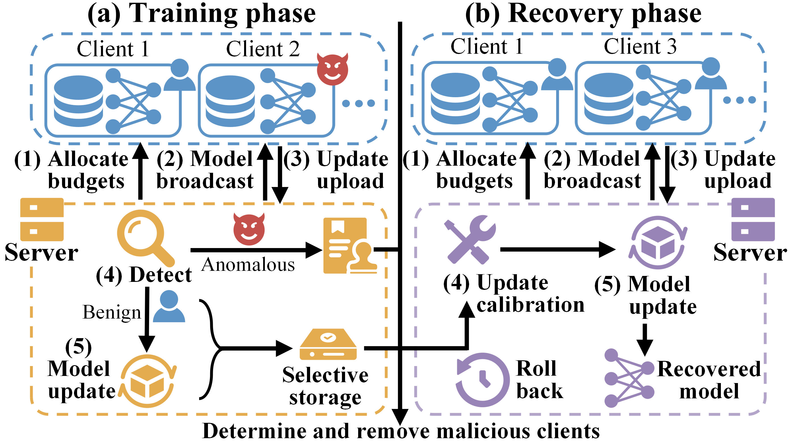
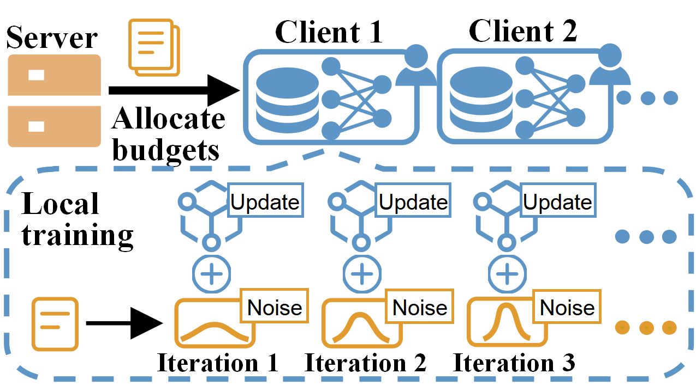

# DIARY [](https://doi.org/10.5281/zenodo.18321979)

This repository contains a PyTorch implementation of the paper **DIARY: Differentially Private Recovery with Adaptive Privacy Budgets in Federated Unlearning (WWW 2026).**

**Note: This repository will be updated in the next few days for readability and completeness. Please stay tuned!**

|                            DIARY                             |                  Privacy Budget Allocation                   |
| :----------------------------------------------------------: | :----------------------------------------------------------: |
|  |  |

**Our implementation extends the [Opacus](https://github.com/pytorch/opacus) library to support DIARY’s adaptive privacy budget allocation and privacy cost estimation, allowing each participant to set personalized, non-uniform budgets that align with their privacy preferences.**

## 1. Setup
### Create a Conda Environment
```
# install the python
conda create -n DIARY python==3.8.0
conda activate DIARY
# install the pytorch and torchvision
pip install pytorch==2.8.0 torchvision==0.23.0 torchaudio==2.8.0 --index-url https://download.pytorch.org/whl/cu129
```
### Install Other Dependencies
```
pip install -r requirements.txt
```

## 2. Dataset Download and Divided
When you run the experiment, the dataset will be automatically downloaded and divided according to the configuration file.


## 3. Run the Experiment
You can find some configuration files in folder `config` and run the following commands:
```bash
python main.py --config config/test/fmnist.yaml
```
For more detailed parameters setting, you can check the configuration files.

## 4. Learn More
- [Global privacy loss of various composition methods](./tutorials/global_privacy_loss_comparison.ipynb)
- [Simulation curvefitting](./tutorials/simulation_curvefitting.ipynb)

## Acknowledgements

We would like to thank for [Opacus](https://github.com/pytorch/opacus) library.

